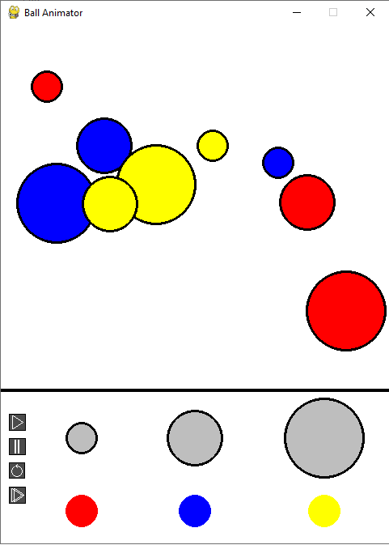

# Ball Animator

A simple and interactive ball animation application built with Python that allows users to create and manipulate colorful bouncing balls of different sizes.



## Features

- Create balls of three different sizes (small, medium, large)
- Choose from three different colors (red, blue, yellow)
- Interactive control panel with:
  - Play/Pause button
  - Stop button
  - Reset button
  - Speed up button
- Real-time ball physics simulation
- Multiple balls can coexist in the animation space

## Controls

The application provides a control panel at the bottom of the window with the following options:

- **Size Selection**: Choose from three different ball sizes
  - Small
  - Medium
  - Large
  
- **Color Selection**: Pick from three colors
  - Red
  - Blue
  - Yellow
  
- **Animation Controls**:
  - ▶️ Play/Pause - Start or pause the animation
  - ⏹️ Stop - Stop the animation
  - 🔄 Reset - Clear all balls and reset the animation
  - ⏩ Speed Up - Increase the animation speed

## How to Use

1. Select a ball size from the size options
2. Choose a color for your ball
3. Click anywhere in the animation area to create a ball
4. Use the control buttons to manage the animation
5. Create multiple balls with different combinations of sizes and colors

## Technical Details

The project is structured with the following main components:

- `main.py`: Main application window and event handling
- `ball.py`: Ball class implementation with physics logic
- `button.py`: Button class for UI controls
- `config.py`: Configuration settings and constants

## Requirements

- Python 3.x
- pygame

## Running the Application

To run the application, simply execute:

```bash
python main.py
```

## License

This project is open source and available under the MIT License.
